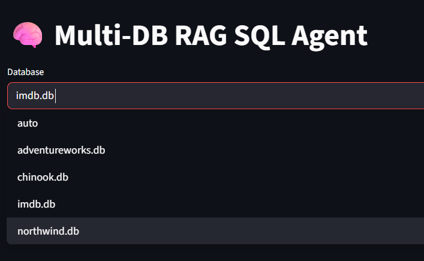
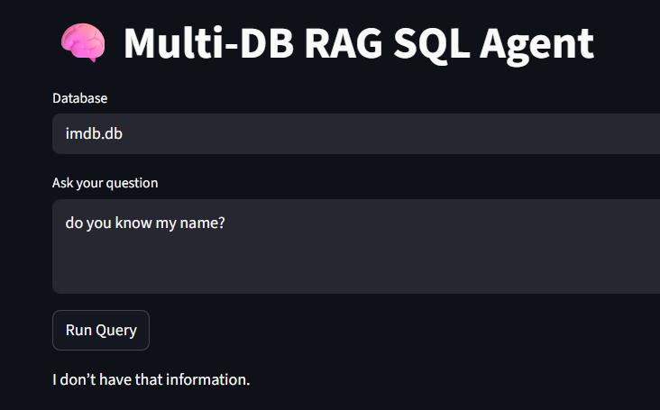

# 🧠 Multi-DB RAG SQL Agent

A schema-grounded, multi-database natural language to SQL agent with automatic database routing and self-healing SQL.

This project allows users to ask natural language questions and get verified SQL results from multiple SQLite databases using a Retrieval-Augmented Generation (RAG) approach over database schemas.


  

---

## 🚀 Features

- Natural Language → SQL generation
- Multi-database support (SQLite)
- Automatic database routing
- Schema-aware RAG prompting
- Self-healing SQL (automatic retry on errors)
- SQL safety layer (blocks destructive queries)
- Streamlit Web UI
- FastAPI backend API

---

## 🗂 Supported Databases

Place the following SQLite databases inside the `databases/` folder:

- `chinook.db`
- `northwind.db`
- `imdb.db`
- `adventureworks.db`

> Databases are not included in the repository.

---

## ⚙️ Installation

```bash
git clone https://github.com/<your-username>/multidb-rag-agent.git
cd multidb-rag-agent

conda create -n genai python=3.10
conda activate genai

pip install -r requirements.txt


Create a .env file:
OPENAI_API_KEY=your_openai_key_here
OPENAI_MODEL=gpt-4o-mini

Run Examples
python examples/test_all_features.py


Streamlit UI
streamlit run web/streamlit_app.py

FastAPI Server
uvicorn web.fastapi_app:app --reload --port 8000


How It Works

Database schemas are extracted and provided to the LLM (RAG)

The LLM generates SQL grounded strictly in schema context

SQL is cleaned, validated, and executed

On failure, the agent automatically retries with corrected SQL

Unsafe SQL is blocked before execution

